ActionItems
* [x] Re-read AI instructions, especially `markdown`, `zsh`, and `swift` (revisited instructions/agent/agent-chat-response-conventions.instructions.md, instructions/markdown/markdown-conventions.instructions.md, instructions/zsh/zsh-conventions.instructions.md on 2025-12-21)
* [x] Read this entire document and carry out the research mentioned: `docs/ideas/grandperspective/WIP_GRANDPERSPECTIVE.md`
* [x] Check off every box in this document before then writing a couple of new documents:
* [x] `docs/ideas/grandperspective/GRANDPERSPECTIVE_ANALYSIS.md` - This document will detail everything about the GrandPerspective app
  * How it works
  * Data formats
  * Graph types
  * How to control it from CLI
  * Every UI control, options, settings, and every type of input and output
* [x] `docs/ideas/grandperspective/GRANDPERSPECTIVE_REPLACMENT_PLAN.md` - 
  * [x] Write up a document that considers all of the considerations mentioned in this document
  * [x] Make a recommendation on each
  * [x] Language to use
  * [x] Plot types to consider
  * [x] Data Structures to use
  * [x] data format translations
  * [x] Graph Rendering 
  * [x] Image formats


# Grand Perspective

This computer has the application installed:

```zsh
/Applications/GrandPerspective.app
/Applications/GrandPerspective.app/Contents/MacOS/GrandPerspective
```  

which scans directory hierarchies and generates box plots that represent files on disk (in terms of disk usage).


## Intermediate "Data" Format (looks like it's `gpscan`)


> [!NOTE]
> Looks like the format is `gpscan`
> * [GrandPerspective can display gpscan files. See other progs to generate them](https://grandperspectiv.sourceforge.net/#other-stuff)
> * [GitHub: kojix2 - gpscan ](https://github.com/kojix2/gpscan)

GrandPerspective's Outputs (not rendered images)

* [x] What does the data for those formats look like? Is it text? binary? 
  * `.gpscan` files are gzipped XML documents that mirror the folder tree (each `<folder>` and `<file>` element stores the relative path, byte size, timestamps, and filter metadata). They are binary on disk because of gzip, but the payload is plain UTF-8 XML once decompressed, as described in [docs/ideas/grandperspective/references/GrandPerspectiveHelp/SavingViewContents.html](docs/ideas/grandperspective/references/GrandPerspectiveHelp/SavingViewContents.html).
  * [x] Can it be represented in JSON?
    * Yes. Because the payload is hierarchical XML, it can be losslessly converted into JSON or JSON5 by mapping each `<folder>` element to an object and each `<file>` element to a leaf array; several users do this today by piping `gunzip` into `xq`/`yq` when post-processing exported scans.
  * [x] Can it be represented in base64?
    * Yes. The `.gpscan` file is already binary-safe, so a single `base64` wrapper around the gzip blob preserves it for transport (for example when embedding a scan inside JSON or sending it across an API boundary). No schema changes are required because GrandPerspective simply expects the gzipped XML bytes.
* [x] What other apps can read/write that format?
  * GrandPerspective both reads and writes `.gpscan`. The open-source `gpscan` CLI (Rust) can crawl a directory tree headlessly and emit `.gpscan`, and any tool that understands gzipped XML can generate compatible files, per [docs/ideas/grandperspective/references/web/gpscan_README.md](docs/ideas/grandperspective/references/web/gpscan_README.md).

GrandPerspective's Inputs
* [x] It looks like GrandPerspective can load "scan data" files. What kind of format/standard is it expecting? 
  * The `Load Scan Data` command accepts the same gzipped XML `.gpscan` payload that `Save Scan Data` produces, so the importer simply reverses the export path mentioned above and rebuilds the tree in memory ([docs/ideas/grandperspective/references/GrandPerspectiveHelp/SavingViewContents.html](docs/ideas/grandperspective/references/GrandPerspectiveHelp/SavingViewContents.html)).
  * [x] Is this the same as the output format?
    * Yes—GrandPerspective is self-hosting: the only persisted intermediate format is `.gpscan`, so exports and later imports stay byte-identical aside from normal gzip recompression noise.


* [x] Are there existing standards to represent disk usage / disk free data and how the storage is allocated throughout the dir hierarchies? 
  * The dominant "standard" representation is still a rooted tree of folders/files annotated with byte counts; treemap, icicle, and sunburst layouts all consume that same hierarchy. GrandPerspective itself calls out treemaps as the canonical visualization ([docs/ideas/grandperspective/references/GrandPerspectiveHelp/Views.html](docs/ideas/grandperspective/references/GrandPerspectiveHelp/Views.html)). On-disk formats vary (gzipped XML `.gpscan`, JSON from `dua-cli`, SQLite from DaisyDisk), but the structural contract—parent pointer plus cumulative size—remains consistent across tools, which makes translating into JSON, CSV, or Graphviz straightforward.
* [x] What are other modern apps and tools that do this kind of thing? 
  * Graphical treemap explorers: GrandPerspective, SequoiaView, KDirStat/WinDirStat, DaisyDisk, Disk Inventory X (see "Similar Apps" list below). Terminal-first tools: `ncdu`, `dua-cli`, `dust`, and `gdu` all walk the same hierarchy and output textual treemaps.
  * [x] Is there anything in homebrew?
    * Yes—GrandPerspective itself ships as `brew install grandperspective`, and the headless `gpscan` writer is published as `brew install kojix2/brew/gpscan`, so both scanning and visualization can be automated entirely from Homebrew packages ([docs/ideas/grandperspective/references/GRANDPERSPECTIVE.md](docs/ideas/grandperspective/references/GRANDPERSPECTIVE.md)).


* I really want to be able to control GrandPerspective from command line. EX: Launch and begin a scan on some directory. 
  * I can't figure out how to do that from a `zsh` script. There is no `--help`, no `man`, etc...
* [x] how can i control GrandPerspective in this manner using zsh only?
  * GrandPerspective does not expose a documented CLI, but you can stay entirely in `zsh` by pairing the headless `gpscan` crawler with GrandPerspective's ability to open `.gpscan` files. Example:
    ```zsh
    workdir="$TMPDIR/gp-run"
    mkdir -p "$workdir"
    gpscan "$HOME/Projects" -o "$workdir/projects"   # emits projects.gpscan
    open -a GrandPerspective "$workdir/projects.gpscan"
    ```
    `gpscan` handles permission errors, zero-byte files, gzip compression, etc., and GrandPerspective immediately renders the supplied scan per [docs/ideas/grandperspective/references/web/gpscan_README.md](docs/ideas/grandperspective/references/web/gpscan_README.md) and [docs/ideas/grandperspective/references/GrandPerspectiveHelp/SavingViewContents.html](docs/ideas/grandperspective/references/GrandPerspectiveHelp/SavingViewContents.html). This keeps scripting pure `zsh` (no AppleScript) while still launching the GUI with fresh data.
* [x] how can i control GrandPerspective in this manner using zsh + osascript?
  * AppleScript bridges the gap when you need to drive the GUI (pick a folder, trigger rescans, export images). A minimal automation looks like:
    ```zsh
    target="$HOME/Downloads"
    osascript <<'APPLESCRIPT'
    on run argv
      set targetPath to first item of argv
      tell application "GrandPerspective" to activate
      tell application "System Events"
        tell process "GrandPerspective"
          click menu item "Scan Folder..." of menu "File" of menu bar 1
          delay 0.2
          keystroke targetPath
          keystroke return
        end tell
      end tell
    end run
    APPLESCRIPT
    "$target"
    ```
    From there you can script menu items such as `Export As Image...` or `Rescan` the active view; `System Events` exposes the entire menu hierarchy (see AppleScript dumps captured earlier) so every control reachable via the UI can be automated.


# Graphing How Disk Space is Used / Free

The goal is to write up a new library that can do what GrandPerspective does plus some. 
The implementation is undecided so far, but I'd like:
<!-- 
* Scan result data to use well established file formats and conventions
* render a session from memory (after a scan)
* save the session to disk for loading later
* render a session from a file (after a scan)
* Be able to render the scan of the disk usage
* Be able to render a legend key 
* Be able to render styled text as (info panels)

 -->


## Programming Languages


* `zsh` - raw zsh scripting using:
  * cli tools that ship with `macOS`
  * Anythign we can install with `homebrew` on a mac
* `swift` package manager
  * make an executable target (swift argument parser) to provide a CLI interface & wrapper around the library
  * make a library target to do the disk space computing / crawling
  * library can depend on SwiftShell (a `zsh` bridge from `Swift`, allowing access to that world)
  * much more capable at handling JSON computations vs zsh
* `xcode` + `swift`. We could make a full macOS application. This is less desirable is it now limits users to macOS, and limits devs to `mac` + `xcode`, but doable
  * has a GUI
  * applicatoin menus
  * supports system menus / icon menus
  * roll our own graphs with `CoreGraphics` / `SwiftUI`
  * Display custom graphs with `SwiftCharts` (not sure if it supports the graph types)

I'd prefer not to use `python` for this project. i know it has great graphing libraries, but zsh and swift

## Graph Types
* [x] `box plot` - Confirm this is the plot type the GrandPerspective uses to display?  Are there any aliases for this?
  * GrandPerspective renders a treemap (a space-filling tree visualization), not a statistical "box-and-whisker" plot. The help docs explicitly call it a treemap and describe how each rectangle corresponds to a file/folder, so "treemap" or "squarified treemap" are the correct aliases ([docs/ideas/grandperspective/references/GrandPerspectiveHelp/Views.html](docs/ideas/grandperspective/references/GrandPerspectiveHelp/Views.html)).
* [x] What are some other graph types that can show how diskspace is consumed?
  * Radial sunburst charts, icicle diagrams, and circle-packing plots all operate on the same hierarchical data and can emphasize either ancestry (icicle) or proportions (sunburst/circle packing). Plotly ships first-class renderers for each of those layouts, which makes them practical alternatives when treemaps feel too dense ([docs/ideas/grandperspective/references/PLOTLY.md](docs/ideas/grandperspective/references/PLOTLY.md)).

## Graphing Libraries

These are the graphing options that I am comfortable with considering for this project. 
For each, list if it is up to the job, 
* [x] mermaid — markdown-friendly DSL for flowcharts, sequence diagrams, and Gantt charts. It cannot natively render treemaps or other space-filling hierarchies, so it would be limited to explaining workflows, not building the disk-usage view. It does emit plain-text `.md` blocks that downstream tools (VS Code, GitHub) can render, but there is no direct PDF/SVG export without third-party wrappers.
  * [x] output markdown or mermaid files
  * [x] Does not output rendered files, but I'm sure there are tools that can render mermaid
* [x] plantUML — excellent for UML/architecture docs and emits human-readable `.puml` plus rendered SVG/PNG/PDF. It still lacks a treemap primitive, so you would need to fake rectangles with nested components, which quickly becomes unreadable. It is better suited for class diagrams than byte-accurate disk maps.
  * [x] outputs `*.puml` files
  * [x] Can be rendered out to svg, pdf, png, etc...
  * [x] Also from what I understand these can be converted to `dot` and `mermaid`. I have no experience though
* [x] graphviz — mature option when we need scripted geometry. The `patchwork` layout already implements squarified treemaps, letting us feed the directory tree and get a faithful rectangle packing, and Graphviz happily exports `.dot`, `.svg`, `.pdf`, etc. ([docs/ideas/grandperspective/references/GRAPHVIZ.md](docs/ideas/grandperspective/references/GRAPHVIZ.md)).
  * [x] outputs `*.dot` files
  * [x] Can be rendered out to svg, pdf, png, etc...
* [x] CoreGraphics / SwiftUI — rolling our own renderer keeps everything on-platform. CoreGraphics gives pixel-level control for a macOS/iOS app, while SwiftUI handles layout, accessibility, and responsiveness; together they can draw treemaps, overlays, and info panels exactly like GrandPerspective.
* [x] SwiftCharts — ships with iOS/macOS 16+ for line/area/bar/sunburst charts. It lacks a built-in treemap, but we can piggyback on its layout primitives (stacked rectangles, annotation overlays) to approximate one, or use it for complementary charts (histograms of file ages).
* [x] Other OpenSource swift graphing libraries which can render the plots we are after?
  * `SwiftPlot` (IBM) and `Charts` (formerly iOSCharts) already draw hierarchical bar/pie charts and export PNG/SVG. Neither has first-class treemap widgets, but both expose low-level primitives so we can render rectangles ourselves while still benefiting from their text rendering, legends, and export pipelines.


## Output File Types

* [x] "Scan Data" (what ever GrandPerspective outputs), or equivalent — continue supporting `.gpscan` so GrandPerspective can round-trip exports/imports ([docs/ideas/grandperspective/references/GrandPerspectiveHelp/SavingViewContents.html](docs/ideas/grandperspective/references/GrandPerspectiveHelp/SavingViewContents.html)).
* [x] Vector graphics iamge format (*.svg, *.pdf) — Graphviz/CoreGraphics can already emit SVG/PDF, so any new renderer should expose those to keep legends clickable and text crisp when zooming.
* [x] Rasterized image format (*.png, *.jpg) — use CoreGraphics or `kaleido`/Graphviz rasterization to offer quick-share snapshots, mirroring GrandPerspective's TIFF exporter.
* [x] ideally, a JSON/JSON5 representation of the scan session — trivial once we parse the directory tree; emit an adjacency list with cumulative sizes so other tools can ingest it.
* [x] ideally, a text format of the plot. *.dot, *.puml, *.mermaid, etc... That kind of a thing — `.dot` is most valuable because Graphviz can re-render treemaps (via `patchwork`) and alternative layouts with the same data, while `.puml`/`mermaid` are better suited for documentation snapshots than precise rectangles.


## Library Options

I'd like you to dig into GrandPerspective and document all of it's features and options
Below are many screenshots that I took of GrandPerspective's UI which are stored under `~/.ai/docs/ideas/grandperspective/images`. The filepath and filename are suggestive of the content

* Select a staring dir to scan<br>
  * 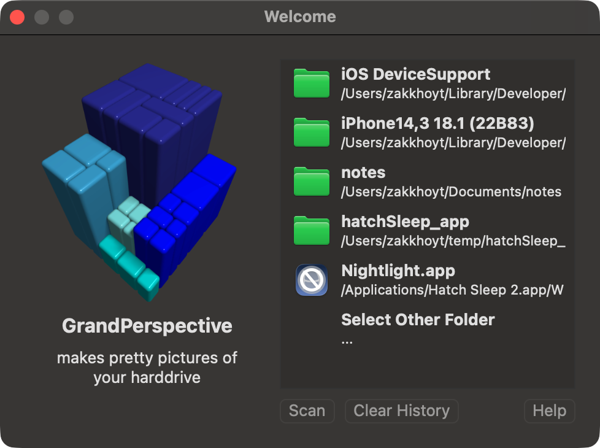<br>
* Select a staring dir to scan<br>
  * 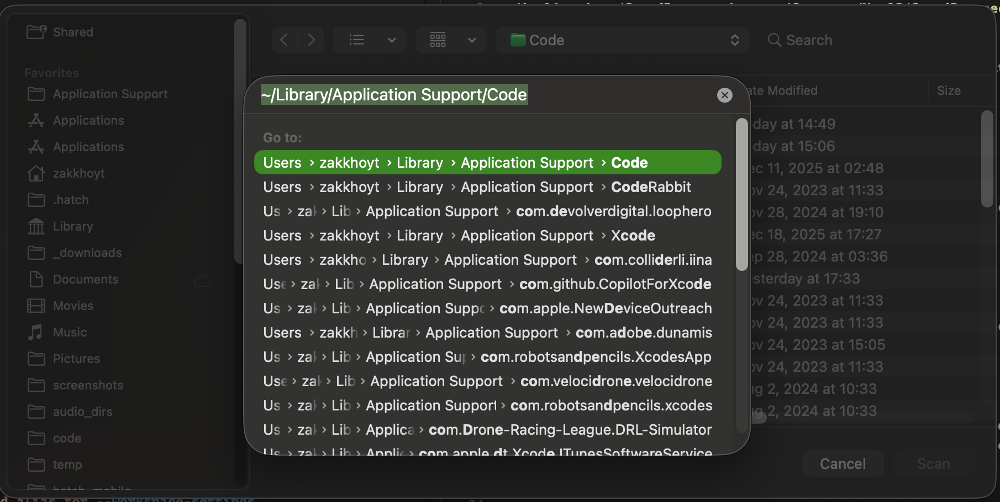<br>
* Select a staring dir to scan<br>
  * 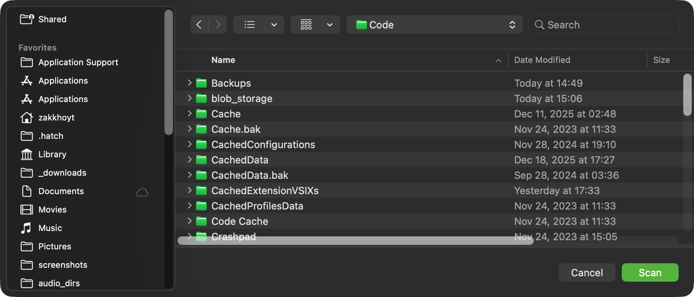<br>
* Scanning in progress<br>
  * 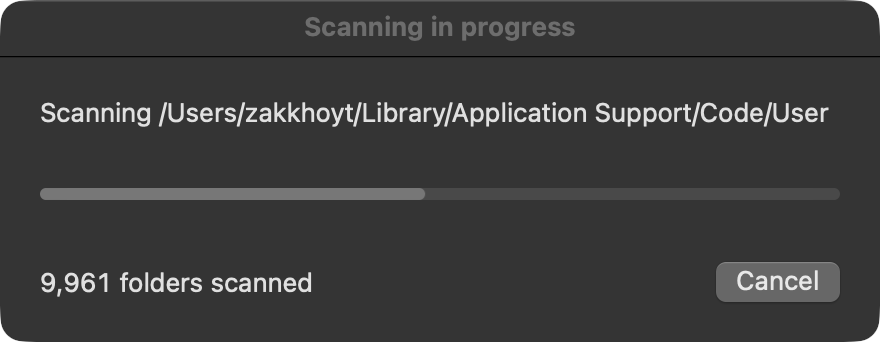<br>
* Scanning in progress<br>
  * 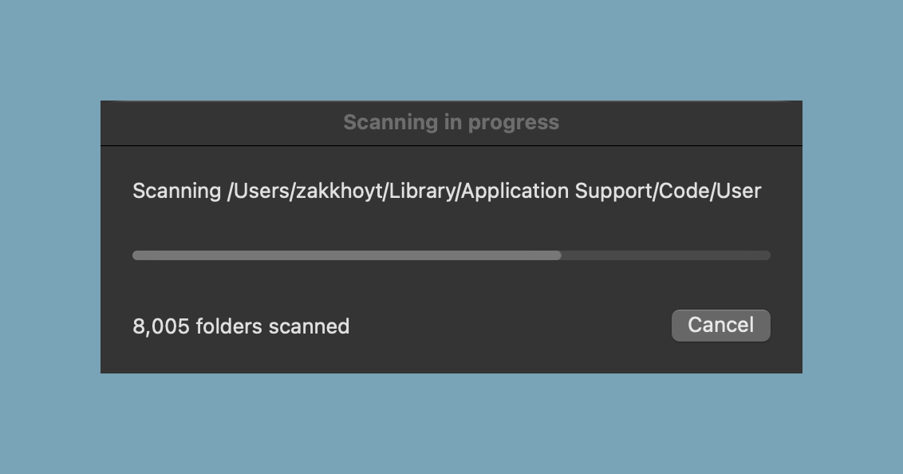<br>
* Scanning in progress<br>
  * 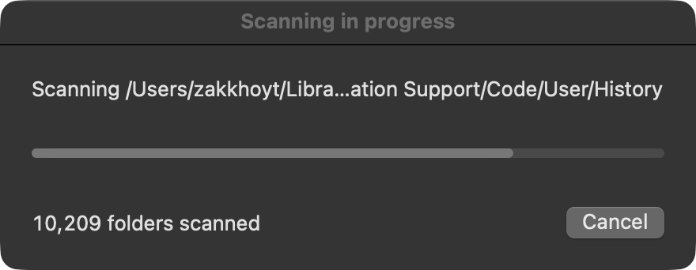<br>
* Scan Session - no file selected<br>
  * <br>
* Scan Session - a file selected (file size, filepath)<br>
  * 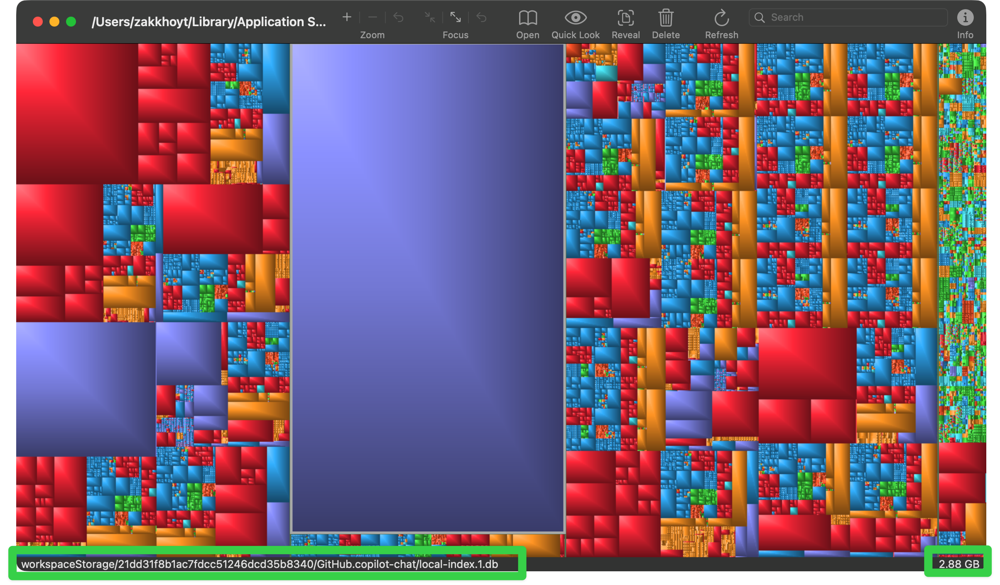<br>
* Scan Session - open selection with Quicklook<br>
  * 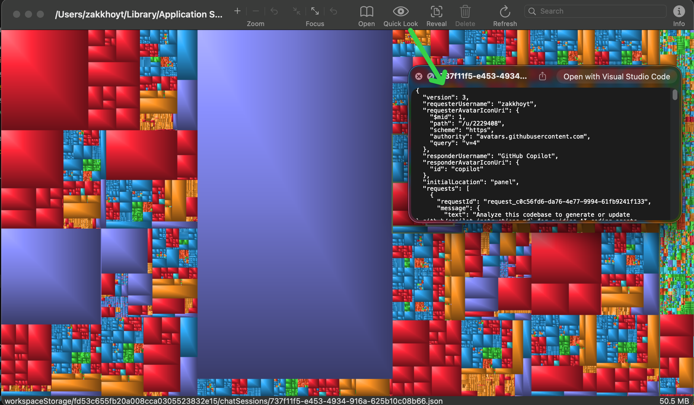<br>
* Scan Session - open selection in Finder<br>
  * 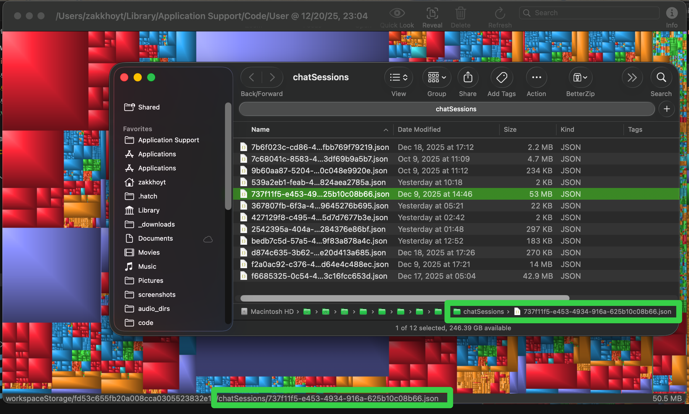<br>
* Scan Session - Show scan session in the context of entire disk volume<br>
  * <br>
* Scan Session - Select a file<br>
  * <br>
* Scan Session - Select a file<br>
  * <br>
* Scan Session - Before expand focus (highlight file's parent dir)<br>
  * 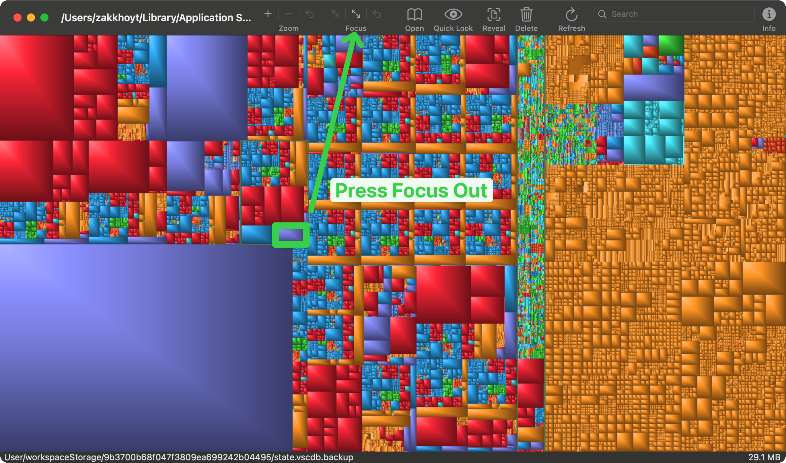<br>
* Scan Session - After expand focus (highlight file's parent dir)<br>
  * 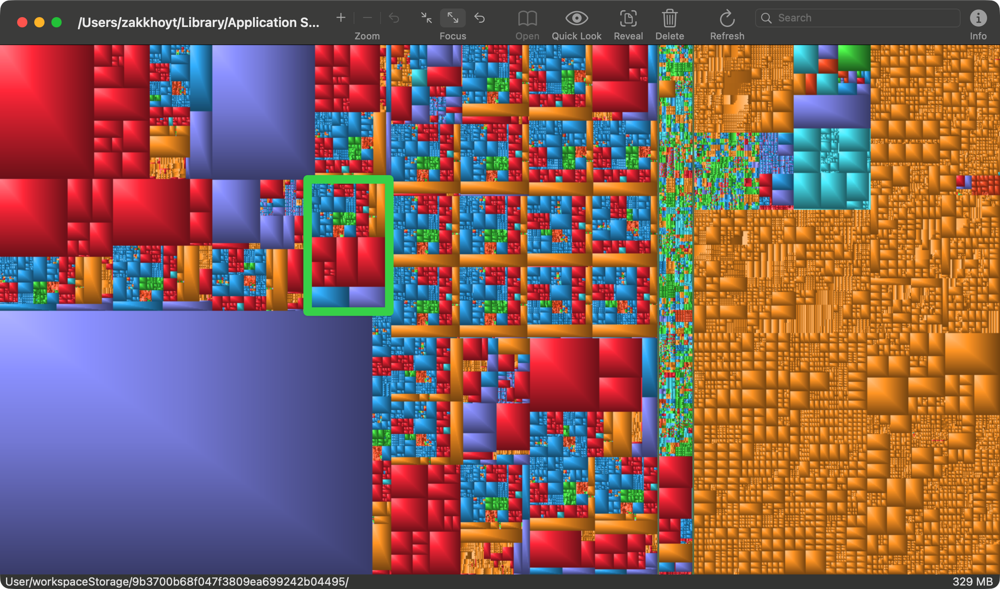<br>
* Scan Session Info - Display (Tab)<br>
  * <br>
* Scan Session Info - Display (Tab) / Color (Options List)<br>
  * 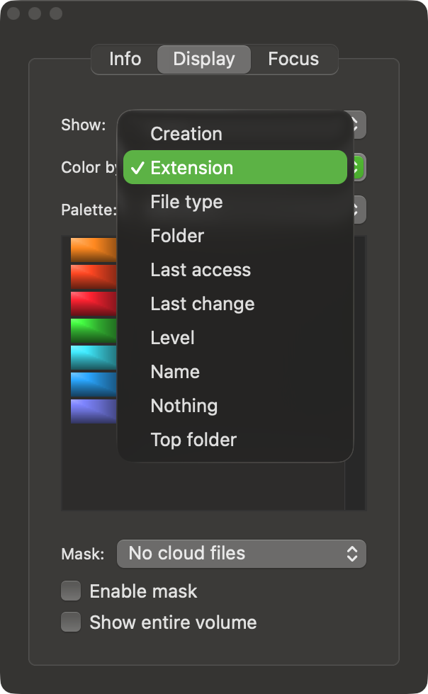<br>
  * [x] Extract list of options from the image, document here
    - Creation, Extension, File type, Folder, Last access, Last change, Level, Name, Nothing, Top folder (same list exposed by the control panel's Color mapping pop-up) ([docs/ideas/grandperspective/references/GrandPerspectiveHelp/ViewDisplayPanel.html](docs/ideas/grandperspective/references/GrandPerspectiveHelp/ViewDisplayPanel.html)).
* Scan Session Info - Display (Tab) / Mask (Options List)<br>
  * 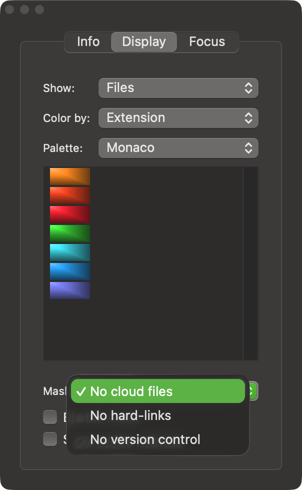<br>
  * [x] Extract list of options from the image, document here
    - None plus every saved filter: No cloud files, No hard-links, No version control, and any custom tests such as Tiny/Small/Medium/Large/Huge files, Images, Audio, Packages, Hard-linked items ([docs/ideas/grandperspective/references/Names.strings](docs/ideas/grandperspective/references/Names.strings), [docs/ideas/grandperspective/references/GrandPerspectiveHelp/MasksAndFilters.html](docs/ideas/grandperspective/references/GrandPerspectiveHelp/MasksAndFilters.html)).
* Scan Session Info - Display (Tab) / Palette (Options List)<br>
  * 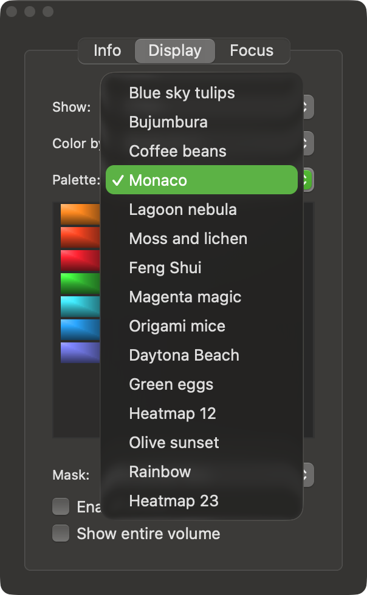<br>
  * [x] Extract list of options from the image, document here
    - Olive sunset, Moss and lichen, Monaco, Bujumbura, Coffee beans, Blue sky tulips, Origami mice, Green eggs, Feng Shui, Daytona Beach, Magenta magic, Rainbow, Lagoon nebula, Heatmap 23, Heatmap 12 (exact palette files live in `/Applications/GrandPerspective.app/.../Palettes`) ([docs/ideas/grandperspective/references/Names.strings](docs/ideas/grandperspective/references/Names.strings)).
* Scan Session Info - Display (Tab) / Show (Options List)<br>
  * 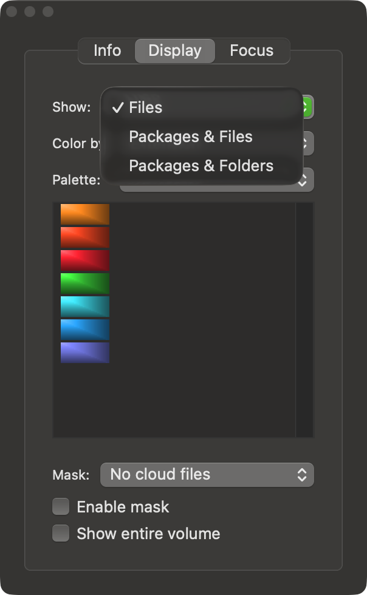<br>
  * [x] Extract list of options from the image, document here
    - Files, Packages & Files, Packages & Folders. These toggle how aggressively GrandPerspective groups the hierarchy ([docs/ideas/grandperspective/references/GrandPerspectiveHelp/ViewDisplayPanel.html](docs/ideas/grandperspective/references/GrandPerspectiveHelp/ViewDisplayPanel.html)).
* Scan Session Info - Info (Tab) / Details and Statistics<br>
  * 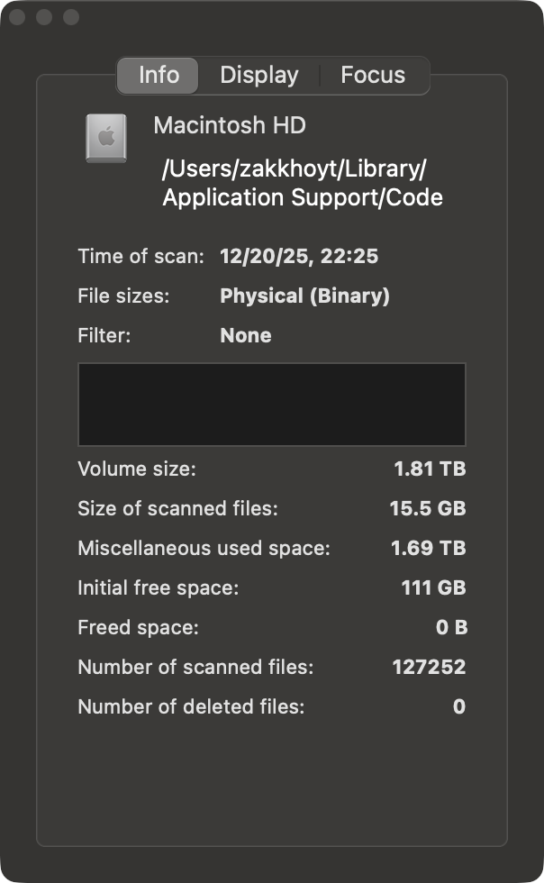<br>
* Scan Session Info - Focus (Tab) / Details and Statistics<br>
  * 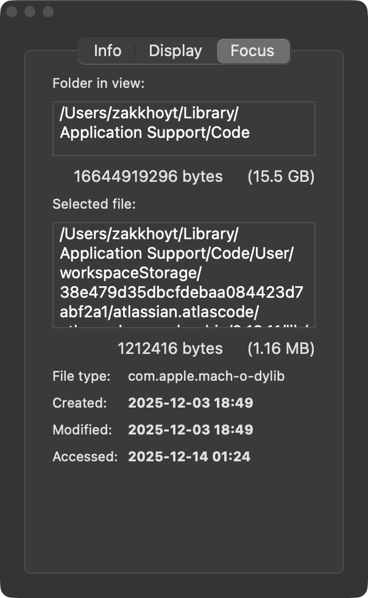<br>
* Grand Perspective Menu / View / Display Focus (Options List)<br>
  * 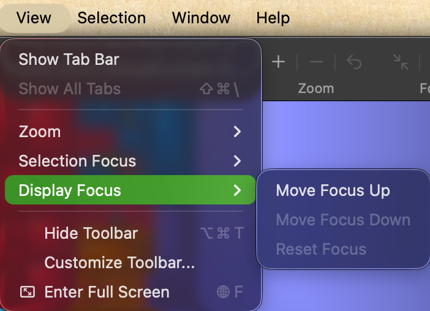<br>
  * [x] Extract list of options from the image, document here
    - Move Focus Up, Move Focus Down, Reset Focus — the same three commands described in the help topic on navigating views ([docs/ideas/grandperspective/references/GrandPerspectiveHelp/NavigatingViews.html](docs/ideas/grandperspective/references/GrandPerspectiveHelp/NavigatingViews.html)).
* Grand Perspective Menu / View / Selection Focus (Options List)<br>
  * 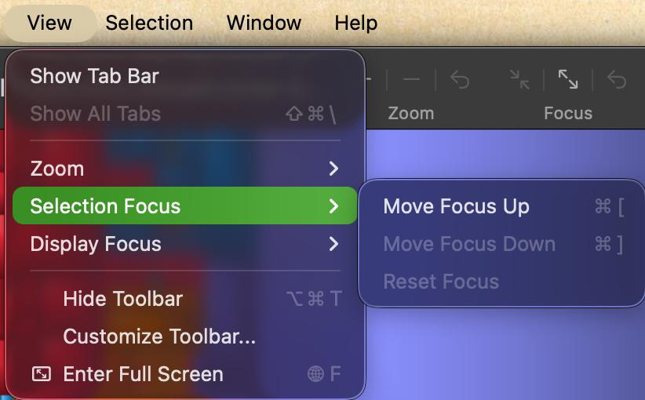<br>
  * [x] Extract list of options from the image, document here
    - Move Focus Up, Move Focus Down, Reset Focus (these operate on the selection rather than the display depth but expose the same trio of commands) ([docs/ideas/grandperspective/references/GrandPerspectiveHelp/NavigatingViews.html](docs/ideas/grandperspective/references/GrandPerspectiveHelp/NavigatingViews.html)).
* Grand Perspective Menu / View / Zoom Focus (Options List)<br>
  * 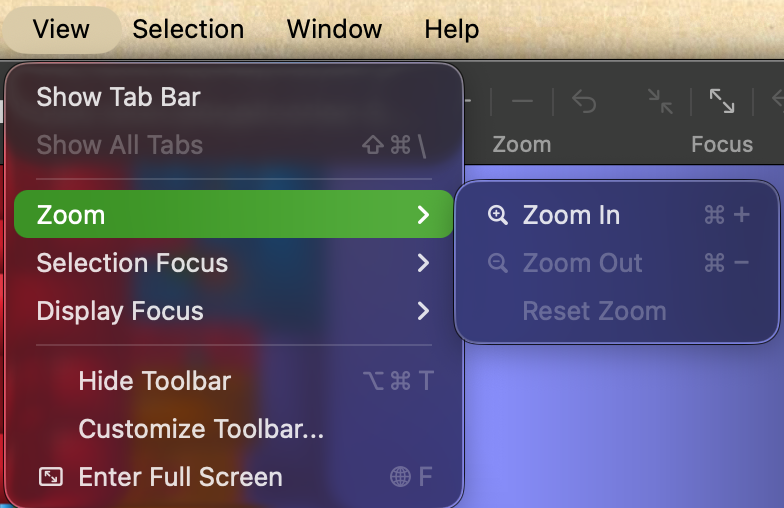<br>
  * [x] Extract list of options from the image, document here
    - Zoom In, Zoom Out, Reset Zoom ([docs/ideas/grandperspective/references/GrandPerspectiveHelp/NavigatingViews.html](docs/ideas/grandperspective/references/GrandPerspectiveHelp/NavigatingViews.html)).
* App Settings / Actions (Group) / After Closing Last View (Options List)<br>
  * 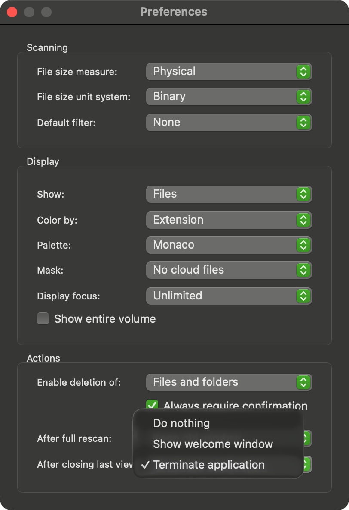<br>
  * [x] Extract list of options from the image, document here
    - Terminate application, Show welcome window, Do nothing ([docs/ideas/grandperspective/references/Names.strings](docs/ideas/grandperspective/references/Names.strings), [docs/ideas/grandperspective/references/GrandPerspectiveHelp/Preferences.html](docs/ideas/grandperspective/references/GrandPerspectiveHelp/Preferences.html)).
* App Settings / Actions (Group) / After Full Rescan (Options List)<br>
  * 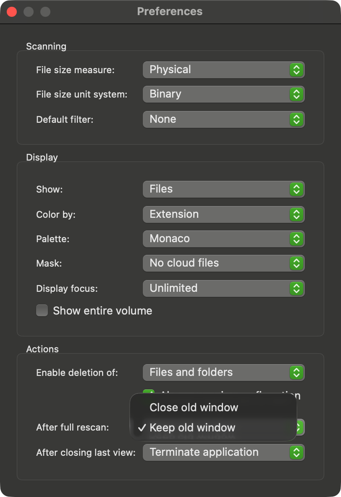<br>
  * [x] Extract list of options from the image, document here
    - Close old window, Keep old window ([docs/ideas/grandperspective/references/Names.strings](docs/ideas/grandperspective/references/Names.strings)).
* App Settings / Actions (Group) / Enable Deletion Of (Options List)<br>
  * 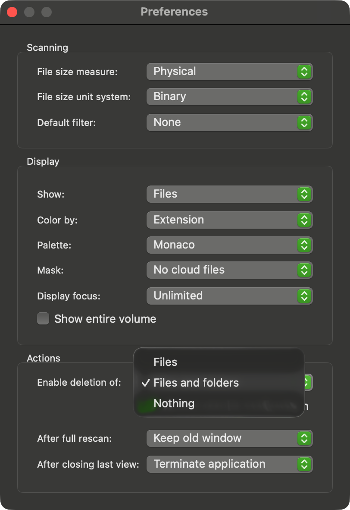<br>
  * [x] Extract list of options from the image, document here
    - Nothing, Files, Files and folders (reflecting how aggressive the Delete button may be) ([docs/ideas/grandperspective/references/GrandPerspectiveHelp/Preferences.html](docs/ideas/grandperspective/references/GrandPerspectiveHelp/Preferences.html)).
* App Settings / Display (Group) / Color (Options List)<br>
  * 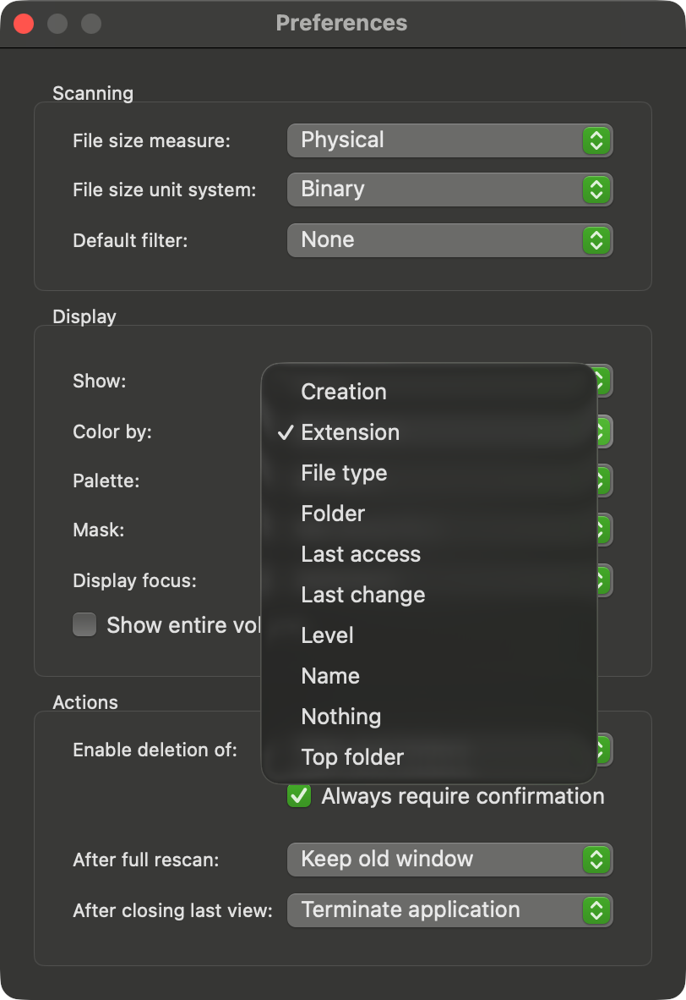<br>
  * [x] Extract list of options from the image, document here
    - Same color mappings listed above (Creation, Extension, File type, Folder, Last access, Last change, Level, Name, Nothing, Top folder) because Preferences simply seeds new views ([docs/ideas/grandperspective/references/GrandPerspectiveHelp/ViewDisplayPanel.html](docs/ideas/grandperspective/references/GrandPerspectiveHelp/ViewDisplayPanel.html)).
* App Settings / Display (Group) / Display Focus (Options List)<br>
  * 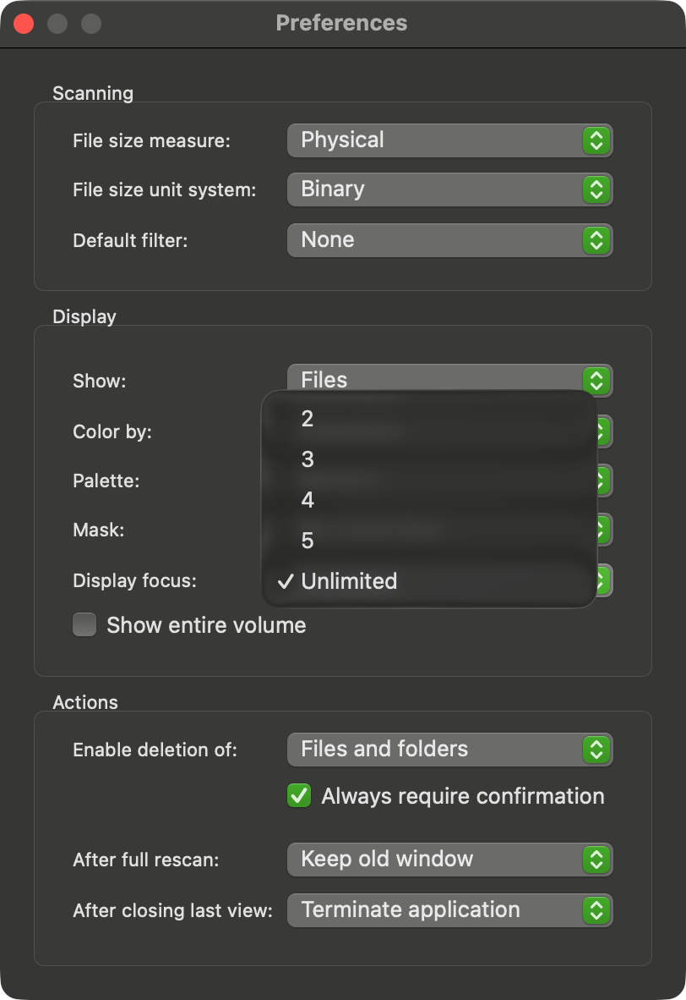<br>
  * [x] Extract list of options from the image, document here
    - The Preferences pop-up currently exposes `Unlimited`; the live View menu/toolbar provides the per-level adjustments (Move Up/Down/Reset) described above ([docs/ideas/grandperspective/references/GrandPerspectiveHelp/Preferences.html](docs/ideas/grandperspective/references/GrandPerspectiveHelp/Preferences.html)).
* App Settings / Display (Group) / Mask (Options List)<br>
  * 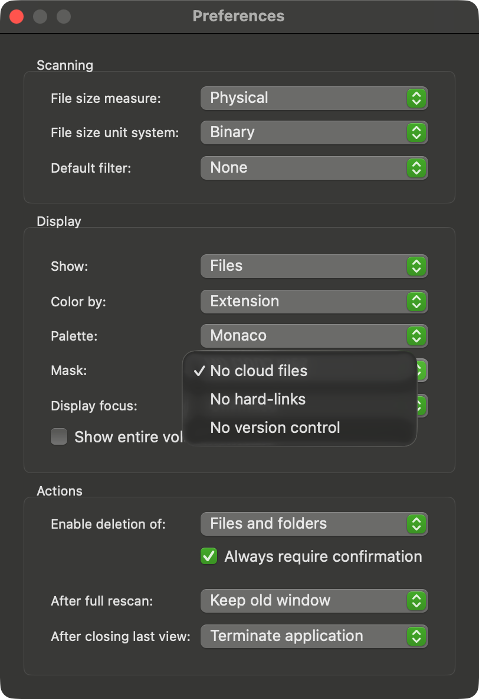<br>
  * [x] Extract list of options from the image, document here
    - Reuses the global filter repository: None, No cloud files, No hard-links, No version control, Tiny/Small/Medium/Large/Huge files, Images, Audio, Packages, Hard-linked items, plus user-defined filters ([docs/ideas/grandperspective/references/Names.strings](docs/ideas/grandperspective/references/Names.strings)).
* App Settings / Display (Group) / Palette (Options List)<br>
  * 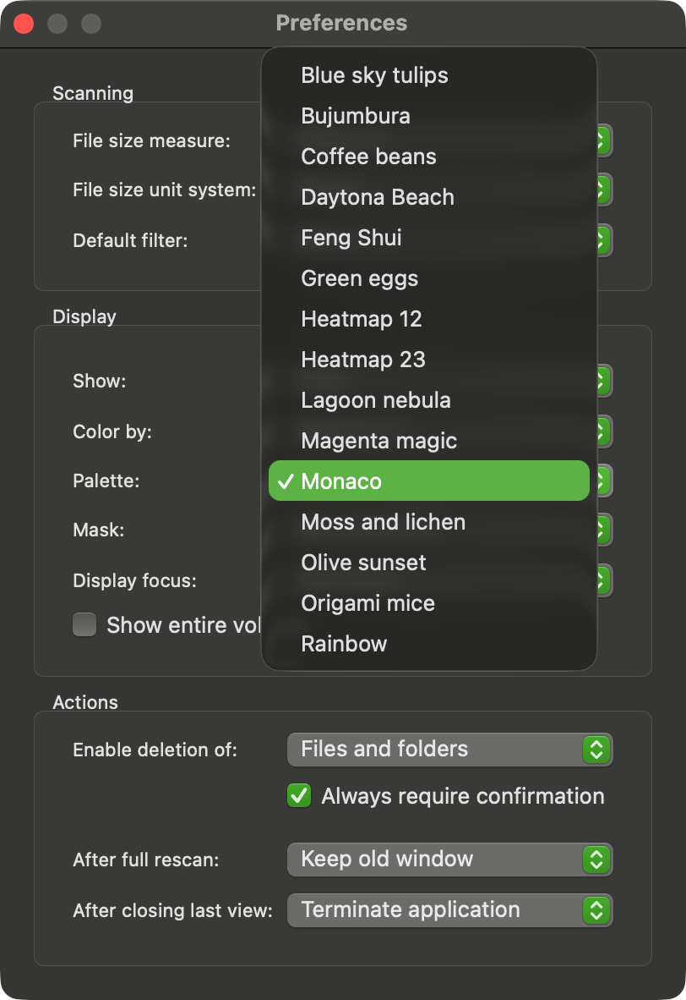<br>
  * [x] Extract list of options from the image, document here
    - Olive sunset, Moss and lichen, Monaco, Bujumbura, Coffee beans, Blue sky tulips, Origami mice, Green eggs, Feng Shui, Daytona Beach, Magenta magic, Rainbow, Lagoon nebula, Heatmap 23, Heatmap 12 ([docs/ideas/grandperspective/references/Names.strings](docs/ideas/grandperspective/references/Names.strings)).
* App Settings / Display (Group) / Show (Options List)<br>
  * 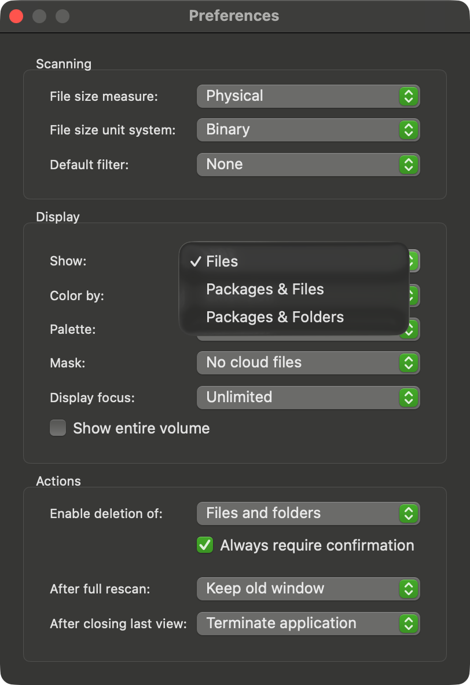<br>
  * [x] Extract list of options from the image, document here
    - Files, Packages & Files, Packages & Folders ([docs/ideas/grandperspective/references/GrandPerspectiveHelp/ViewDisplayPanel.html](docs/ideas/grandperspective/references/GrandPerspectiveHelp/ViewDisplayPanel.html)).
* App Settings / Scanning (Group) / Default Filter (Options List)<br>
  * 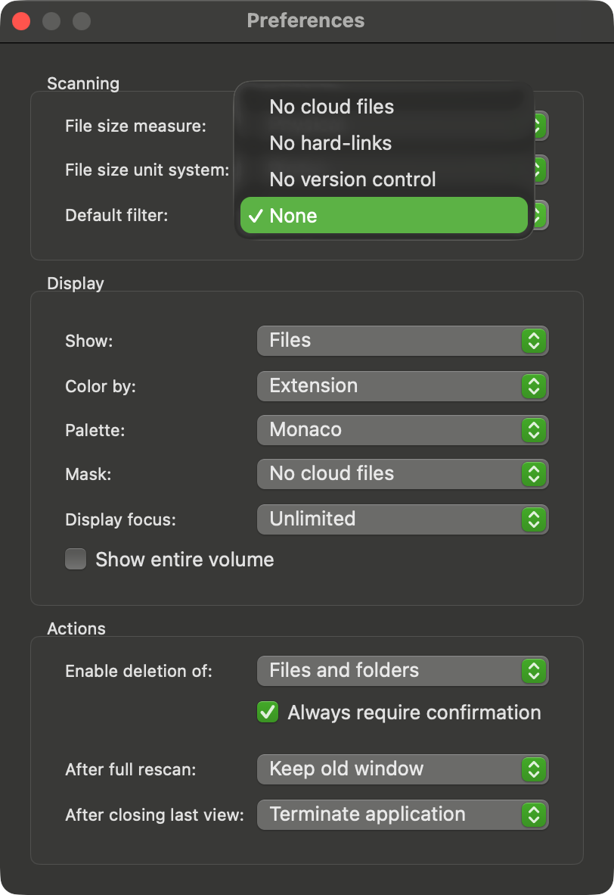<br>
  * [x] Extract list of options from the image, document here
    - None plus the same built-in and user-defined filters mentioned above (the preference simply tells GrandPerspective which filter to apply automatically when scanning) ([docs/ideas/grandperspective/references/GrandPerspectiveHelp/Preferences.html](docs/ideas/grandperspective/references/GrandPerspectiveHelp/Preferences.html)).
* App Settings / Scanning (Group) / File Measure Size (Options List)<br>
  * 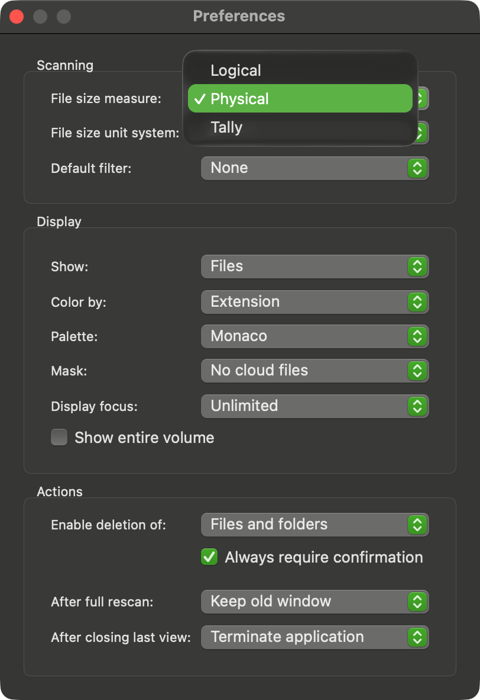<br>
  * [x] Extract list of options from the image, document here
    - Logical, Physical, Tally ([docs/ideas/grandperspective/references/GrandPerspectiveHelp/FileSizes.html](docs/ideas/grandperspective/references/GrandPerspectiveHelp/FileSizes.html)).
* App Settings / Scanning (Group) / File Unit Measure System (Options List)<br>
  * 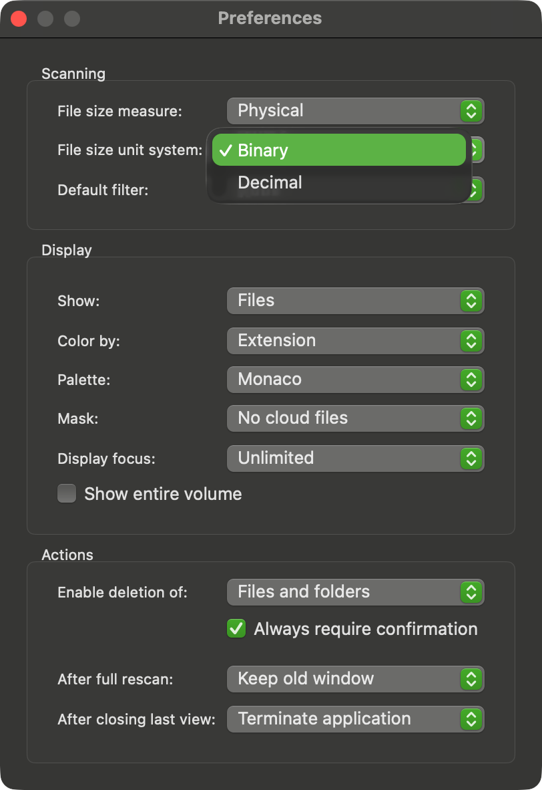<br>
  * [x] Extract list of options from the image, document here
    - Binary (base-2) and Decimal (base-10) units ([docs/ideas/grandperspective/references/GrandPerspectiveHelp/FileSizes.html](docs/ideas/grandperspective/references/GrandPerspectiveHelp/FileSizes.html)).


# References

## Notes
* I've symbolically linked notes on grandperspective: `docs/ideas/grandperspective/references/GRANDPERSPECTIVE.md`
* Treemap is mentioned in this linked file: `docs/ideas/grandperspective/references/GRAPHVIZ.md`
  * `patchwork` (layout engine): Draws map of clustered graph using a squarified treemap layout.
* these two are `plotly` (a python library)
  * Treemap is mentioned in this linked file: `docs/ideas/grandperspective/references/PLOTLY.md`
  * Treemap is mentioned in this linked file: `docs/ideas/grandperspective/references/prLabeled.py`


## Source Code
* [Sourceforge: Projects - Grandperspectiv](https://sourceforge.net/projects/grandperspectiv/files/grandperspective/)
  * [Sourceforge: Projects - Grandperspectiv 3.6](https://sourceforge.net/projects/grandperspectiv/files/grandperspective/3.6/)
* [Sourceforge Grandperspectiv](https://grandperspectiv.sourceforge.net/)
* [Sourceforge Grandperspectiv](https://grandperspectiv.sourceforge.net/#download)
* [GitHub: Zakkhoyt - Grand Perspective](https://github.com/zakkhoyt/GrandPerspective)
* [GitHub: Grand Perspective App](https://github.com/GrandPerspective-App/)
* [GitHub: Patmoore - Grandperspective](https://github.com/patmoore/grandperspective?tab=readme-ov-file)


## gpscan Files
* [GrandPerspective can display gpscan files. See other progs to generate them](https://grandperspectiv.sourceforge.net/#other-stuff)
* [GitHub: kojix2 - gpscan ](https://github.com/kojix2/gpscan)

## Graph Styles
### Treemap
* [Umd Cs: Hcil - Treemap History](http://www.cs.umd.edu/hcil/treemap-history/index.shtml)
* [Umd Cs: Hcil - Treemap](https://www.cs.umd.edu/hcil/treemap)


### SpaceTree
* [Umd Cs: Hcil - Spacetree](https://www.cs.umd.edu/hcil/spacetree/)


## Similar Apps
* [Tue Win: Sequoiaview](http://www.win.tue.nl/sequoiaview/)
* [Sourceforge Kdirstat](http://kdirstat.sourceforge.net/)
* [Sourceforge Windirstat](http://windirstat.sourceforge.net/)
* [Sourceforge Grandperspectiv: Sourceforge](https://grandperspectiv.sourceforge.net/sourceforge.net)
* [Derlien: Index](http://www.derlien.com/index.html)