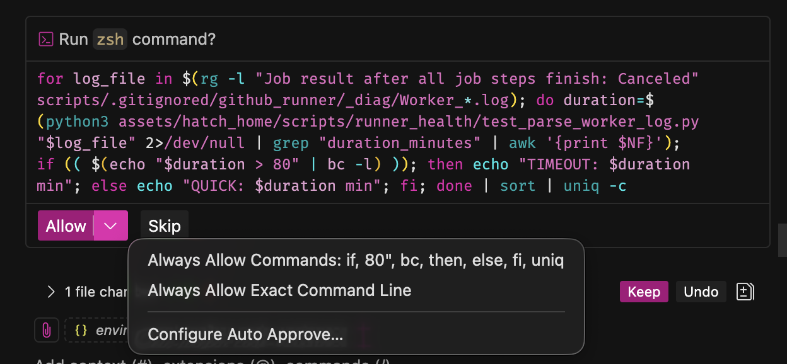
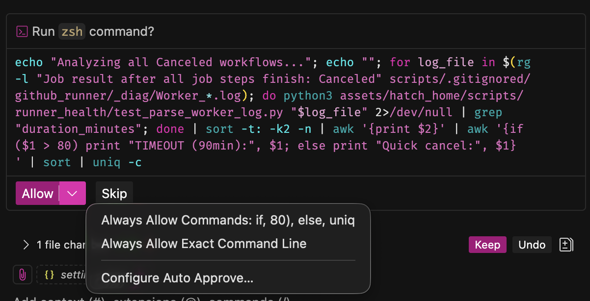
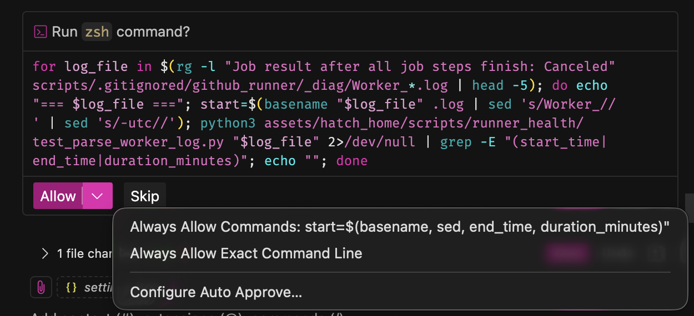
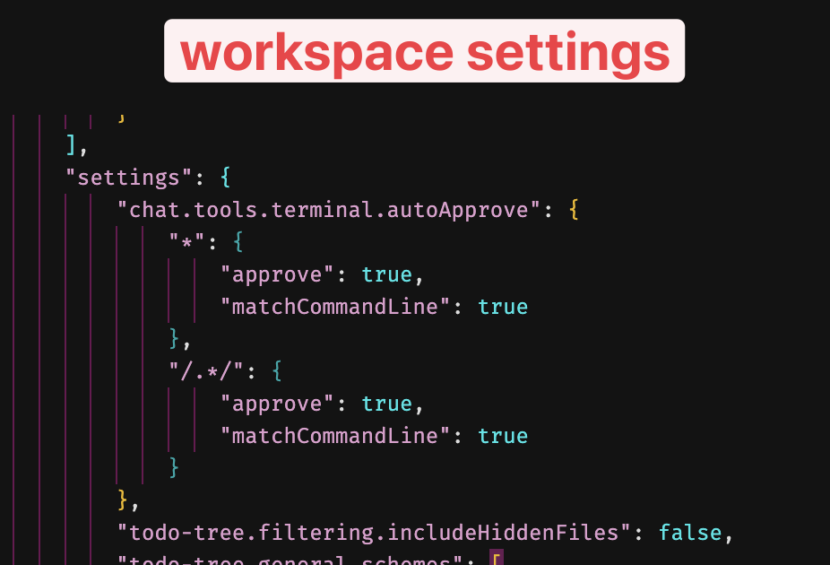
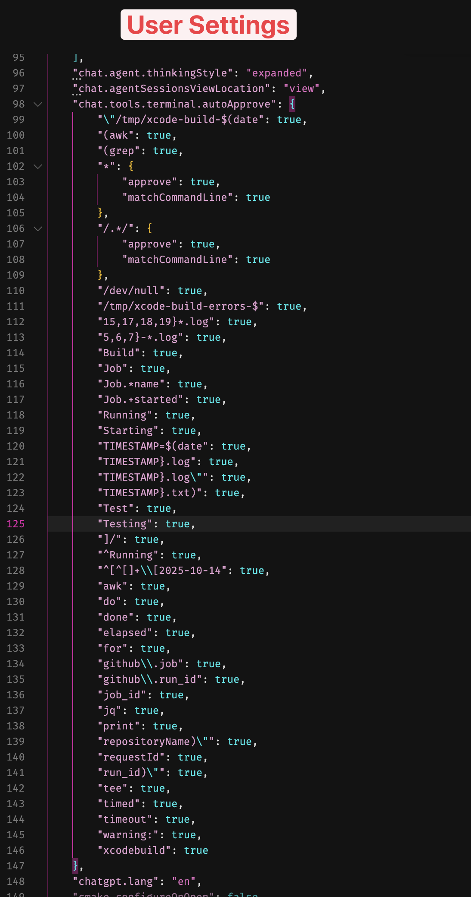

# when sourcing config files, how can we check if it's arleady been sourced then avoid sourcing again?
* will this have impacts from cli: `source ~/.zshrc`. Can we override the check? arguent? Can we zparseopts? --force-source

# update _slog to hanle many things
* detect if output / tty, stipping ANSI related args if not (allowing us to pipe to log files for examples)
* update to take args like `--callstack`
  * `--callstack`
  * `--context <context>`
  * `--rval <rval>` | `--exit-code <code>` | `--return-code <code>`
  * Build a list of other args from TODOs in .zsh_logging_utils


# ripgrep is installed and available and can be much more performant than grep. 

# .aiignore / .aiignored


# Use homebrew to install runtime tools to make things efficient


* how to auto allow things like pipes, $(...), {...}, for loops, etc...
EX: IT treats this grep special asks to allow `cancel|timeout|timed out`
```zsh
grep -iE "(cancel|timeout|timed out)" scripts/.gitignored/github_runner/_diag/Worker_20241104*.log | grep -v "CancellationToken" | head -20
```


# How to configure vscode's ai agent to auto-approve EVERY terminal command. 

I'm trying to set up Visual Studio Code's AI chat agent so that it doesn't need to ask me for approval, ever, when running commands in the terminal. 

Despite setting up both `user` and `workspace` settings to autoapprove like this
```zsh
"chat.tools.terminal.autoApprove": {
    "/.*/": {
        "approve": true,
        "matchCommandLine": true
    },
    "*": {
        "approve": true,
        "matchCommandLine": true
    },
}
```

it continues to prompt me if the command has:

* any pipes (` | `)
* any parentises, braces, or curly braces
* This include for loops, do, while, et...

 
 


Here are is the VScode user and workspace settings

 
 


# How to cconfigure copilot to see what it's thinkign in real time?


# Avoid filtering output. Instead use Tee
xcodebuild -workspace Nightlight.xcworkspace -scheme HatchIoTShadowClient -destination 'platform=iOS Simulator,name=iPhone 15' build 2>&1 | grep -A 5 "error:"

or zome other approach where i can watch the output live
xcodebuild -workspace Nightlight.xcworkspace -scheme HatchIoTShadowClient -destination 'platform=iOS Simulator,name=iPhone 15' build 2>&1 | grep -A 5 "error:"