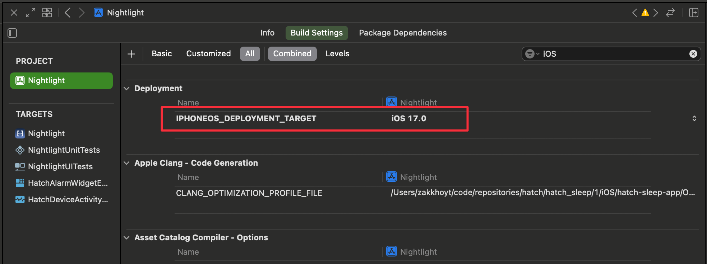
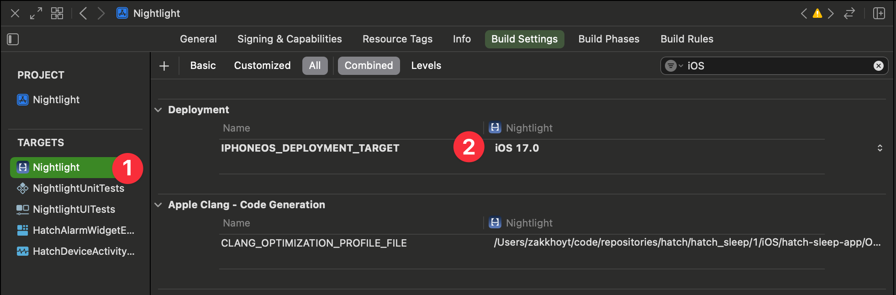

# Monorepo Scripts

## Swift6 Error Categories
* Write a zsh script that will:
* clean and compile our `Nightlight_Development` scheme
  * [ ] <command>
* collect all stdout/stderr logs while filtering the realtime output to only show compiler warnings
* At the end of the build, sort and categorize the errors by root message
  * Split each error into:
    * [ ] root error message <TODO: Example>
    * [ ] error variant <TODO: parts of the message that vary>
    * [ ] filename:line number <TODO: Example>
    * [ ] 
  * exclude things like filename, line number, and error specifiics to come up with a list of error categories
  * do retain the full error message though


## PR Adds <N> new warnings

## PR contains HatchModules resolve warnings
## PR breaks docc


# `docs`

* dont' rely on `get_errors` tool after making significant changes. Intead compile the smallest scheme which includes the changes (package target first, then app if needed)

* compile package first, then app if needed
  * I told agent to compile to find error while working in a module. it compiled the app
    * `xcodebuild -workspace Nightlight.xcworkspace -scheme HatchIoTShadowClient -sdk iphonesimulator -destination 'platform=iOS Simulator,name=Any iOS Simulator Device'
 build 2>&1 | grep -A 5 "error:"`
```sh
xcodebuild -workspace Nightlight.xcworkspace -scheme HatchIoTShadowClient -destination 'platform=iOS Simulator,name=iPhone 15' build 2>&1 | grep -A 5 "error:"
```


# How to configure copilot to see what it's thinkign in real time?

# Avoid filtering output. Instead use Tee
xcodebuild -workspace Nightlight.xcworkspace -scheme HatchIoTShadowClient -destination 'platform=iOS Simulator,name=iPhone 15' build 2>&1 | grep -A 5 "error:"

or zome other approach where i can watch the output live
xcodebuild -workspace Nightlight.xcworkspace -scheme HatchIoTShadowClient -destination 'platform=iOS Simulator,name=iPhone 15' build 2>&1 | grep -A 5 "error:"


--- 

# Fix HatchModule warnings

Invalid Resource 'Resources/Assets.xcassets': File not found.
Invalid Resource 'Resources/Localizable.xcstrings': File not found

dependency 'sdk_conversation_kit_ios' is not used by any target
dependency 'sdk_core_utilities_ios' is not used by any target
 

# zing workflow

# Swift Dependency Bridge

# Montly SPM Updates
* [ ] depenedantbot - generate a dep graph
* [ ] 

# N-1
one per year we drop support for the oldest iOS version that is currenntly supported. That's currently `iOS 17.0`. We need to increment this to the next major version `iOS 18.0`

This change needs to be made in:


## Nightlight.xcodeproj

Project Settings (Nightlight.xcodeproj/project.pbxproj)


Each target (Nightlight.xcodeproj/project.pbxproj) (there are 5 of them)
* this image shows one 1 of the 5
* Ideally the targets should fall back to the project setting. This is not how it is currently setup



## WalkingSkeletonApp.xcodeproj

Approach this in the same manner as `Nightlight.xcodeproj`


## Package.swift

