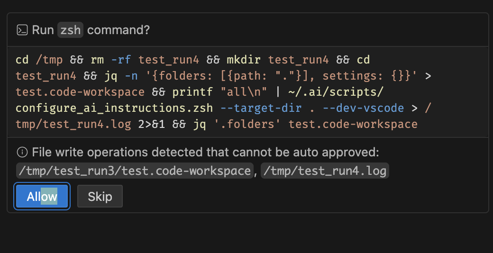

# zsh environment
* zsh_boilerplate 
* zsh_template
* zsh_utilities

* userscripts
  * violentmonkey.zsh
  * markdown_lineker.user.js


---


# .ai

* [X] ~~write the `.ai-checksums` doc under `.gitignored/` (create dir if necessary)~~ (2025-11-26)

## --dev-vscode sort order
* [X] ~~*folders should be sorted in lex ordering*~~ [2025-11-23]
* [X] ~~*update workspace file to add .name property*~~ [2025-11-23]

## Re-write the script using full `zsh` AI instructions


## not adding sections/comments when a repo already contains a  `.github/copilot-instructions.md`


## auto approve

* [ ] Here are some more examples that our default workspace-settings didn't autoapprove 
```zsh
cd /tmp && rm -rf test_run && mkdir test_run && cd test_run && jq -n '{folders: [{path: "."}], settings: {}}' > test.code-workspace && printf "all\n" | ~/.ai/scripts/configure_ai_instructions.zsh --dest-dir . --dev-vscode --debug 2>&1 | tee /tmp/test_run.log
```

* [ ] Another
```zsh
cd /tmp && rm -rf test_run4 && mkdir test_run4 && cd test_run4 && jq -n '{folders: [{path: "."}], settings: {}}' > test.code-workspace && printf "all\n" | ~/.ai/scripts/configure_ai_instructions.zsh --dest-dir . --dev-vscode > /tmp/test_run4.log 2>&1 && jq '.folders' test.code-workspace
```
> [!NOTE]
> File write operations detected that cannot be auto approved: 
> * /tmp/test_run3/test.code-workspace, 
> * /tmp/test_run4.log




